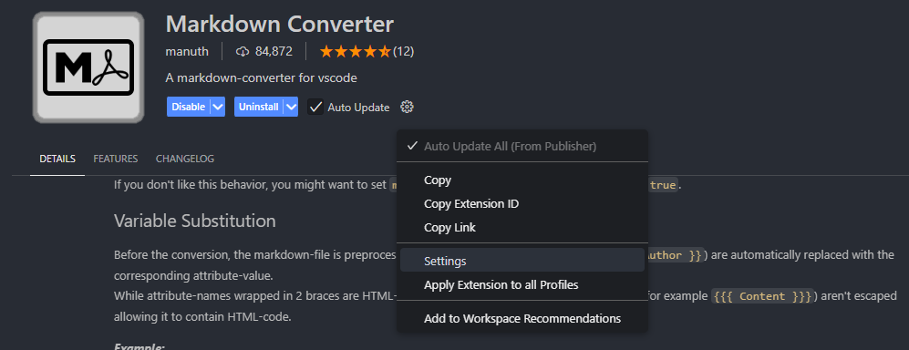

# Markdown Converter Settings

Clicking in the location shown will take you to the settings menu.



Once there the following settings are needed to export a pdf that matches the release, except for the date. This will be current to the export.

## Footer Content

| Item | Value |
|------|-------|
| Center | `<span class="pageNumber"></span>` |

## Footer Template

```html
<div style="position: relative; margin-left: 1cm; margin-right: 1cm; width: 100%; padding-bottom: 1cm;">
    <div style="float: left; text-align: left; ">
        {{{ Left }}}
    </div>
    <div style="position: absolute; left: 0; right: 0; text-align: center; ">
        {{{ Center }}}
    </div>
    <div style="float: right; text-align: right; ">
        {{{ Right }}}
    </div>
</div>
```

## Header Content

| Item | Value |
|------|-------|
| Left | `{{ HeaderTitle }}` |
| Center | `ver. {{ Version }}` |
| Right | `{{ CurrentDate }}` |

## Footer Template

```html
<div style="position: relative; margin-left: 2cm; margin-right: 2cm; width: 100%; padding-top: 0.7cm">
    <div style="float: left; text-align: left; ">
        {{{ Left }}}
    </div>
    <div style="position: absolute; left: 0; right: 0; text-align: center; ">
        {{{ Center }}}
    </div>
    <div style="float: right; text-align: right; ">
        {{{ Right }}}
    </div>
</div>
```

## Margin

| Item | Value |
|------|-------|
| Top | `2cm` |
| Bottom | `2cm` |

## Paper Format

| Item | Value |
|------|-------|
| Format | `A4` |
